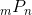
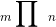
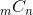
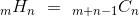

# 코딩 기법 모음

프로그래밍을 하는데 있어서 필수적이고 유용한 기법들을 정리해보자.

<br>

<br>

<br>

시간을 줄이기 위한 scanf 표준 입출력 사용 (예정)

C++에서 무한대 표현하기 (예정)

소수점 밑 반올림 (예정)

[우선순위 큐 (priority_queue) 활용 방법 및 중복 방지](#우선순위-큐-활용하기)

[순열 조합 구현하기](#순열-조합-구현하기)

묶고 싶은 것은 구조체(struct)를 사용하자 (예정)

[배열로 방향과 같은 변화 표현하기](#배열로-방향과-같은-변화-표현하기)

컨테이너속 노드에 구조체를 통해 상태 추가하기 (예정)

[STL 정렬함수 활용하기](#STL-정렬함수-활용하기)

문자열 처리 관련 STL 활용밥 숙지 (예정)

vector에서 중복 원소 제거하기 (예정)

for문 안에서 증감부 조작으로 로직 간소화하기 (예정)

0110101 입력에서 한자리씩 받고 싶을 경우, 그냥 문자열로 받도록 하자 (예정)

<br>

<br>

<br>

## 우선순위 큐 활용하기

less\<T\> 가 default 템플릿 Compare 타입이지만 sort()랑은 다르게 내림차순으로 원소가 정렬되어 있다. 모두 a < b가 true일 때, 모든 stl 정렬이 오름차순이면 좋겠지만, 그렇지 않음을 확인했다. STL에서 구현된 정렬 체계를 혼동하지 않을 필요가 있겠다.

그렇다면 <algorithm\>의 sort()의 비교 커스터마이징과 무엇이 다른것인가? a < b 가 (즉, 비교 결과가) true일 때 비교 대상의 두 원소를 swap하지 않는 것은 sort()와 같다. 다만 우선순위 큐의 경우 **새로 추가하는 것이 자식노드로 삽입된다**. 여기서 max-heap은 부모가 자식보다 크다는 것을 생각하면서 a를 자식노드로, b를 부모노드로 본다면 왜 less<>임에도 내림차순인지 이해할 수 있다. 즉, 새로추가된 자식노드인 a가 b보다 작은 것이 맞다면(true) 바꿔도 되지 않으므로 가장 큰 노드가 가장 위의 뿌리 (가장 높은 부모)로 있는 max-heap, 즉, 꺼낼 때 내림차순이 되는 것이다. sort()와 priority_queue의 정렬체계를 혼동하지 않도록하자. 또한 기억하자.

> STL의 비교 체계에서는 **strict weak ordering**이 적용된다.  

[strict weak ordering 참고자료1](https://adnoctum.tistory.com/206)

[strict weak ordering 참고자료2](http://blog.naver.com/PostView.nhn?blogId=chogahui05&logNo=221301752836&parentCategoryNo=8&categoryNo=6&viewDate=&isShowPopularPosts=false&from=postView)

<br>

또한 아래를 보자

```cpp
#include <queue>

struct xy
{
    int x, y;
    // 구조체 안에서 객체에 대한 operator<(xy &u) 재정의는
    // 소용없음. priority_queue는 정렬 비교를 할 때, 함수를
    // 사용함.
}

struct cmp
{
    bool operator()(const xy &t const xy &u)
    {
        // less -> max-heap -> 내림차순
        if(t.x < u.x) return true;
        // 같을 경우, y를 max-heap -> 내림차순
        else if(t.x == u.x) return t.y < u.y;
        else return false;
    }
}
int main()
{
    priority_queue<xy, vector<xy>, cmp> pq;
    return 0;
}

```

이런 경우, sort에서 마지막 인자로 less\<int\>() 와 같이 임시객체를 준 것과 다르게, priority_queue같은 경우, 템플릿의 인자로써 `type`자체를 줬다. 이 또한, sort의 방식과 혼동하지 않도록 한다.

[우선순위 큐 참고자료](http://www.cplusplus.com/reference/queue/priority_queue/)

<br>

<br>

<br>

<br>

## 순열 조합 구현하기

### 순열(Permutation)



#### m == n 일 때

`#include <algorithm>`의 `next_permutation()` 혹은 `prev_permutation()` 쓰기. 두 함수는 중복되는 수열은 제외시켜서 유용하다.

```cpp
int next_arr[] = { 1,2,3,4,5 };
int len = 0;
cin >> len;
do
{
    for (int i = 0; i < len; i++)
        cout << arr[i] << " ";
    cout << endl;
} 	// 전체 다 할 거라면 next_arr의 원소 개수만큼 더하기
while (next_permutation(next_arr, next_arr + len));


// =========================================
int prev_arr[] = { 5,4,3,2,1 };
do
{
    for (int i = 0; i < len; i++)
        cout << arr[i] << " ";
    cout << endl;
} 	// 전체 다 할 거라면 next_arr의 원소 개수만큼 더하기
while (prev_permutation(prev_arr, prev_arr + len));
```

아래와 같이 직접 구현해서 할 수도 있다.

```cpp
// dfs 활용
void perm(int idx, int depth)
{
	if (depth != -1)
	{
		visited[idx] = true;
		per[depth] = candi[idx];
	}
	// 전역변수 활용할 때
	if (depth == 3)
	{
		// logic
		for (auto i : per)
			cout << i << " ";
		cout << endl;
		visited[idx] = false;
		return;
	}

	for (int i = 0; i < 4; i++)
	{
		if (visited[i] == true) continue;
		perm(i, depth + 1);
		visited[i] = false;
	}
}

int main()
{
    // -1부터 시작
    perm(-1, -1);
    return 0;
}
```

#### m != n 일 때

```cpp
template<typename T>
void swap(T *a, T *b)
{
	T tmp = *a;
	*a = *b;
	*b = tmp;
}

// mPn
template<typename T>
void permutation(T arr[], int m, int n, int depth)
{
    // depth는 0부터 시작하기 때문에 n과 같아졌다는 것은 
    // 길이가 n으로 이미 고정을 완료 했다는 의미
	if (depth == n)
	{
		// 각 순열 케이스에 대한 로직
		for (int i = 0; i < n; i++) cout << arr[i] << " ";
		cout << endl;
	}
	else
	{
		for (int idx = depth; idx < m; idx++)
		{
			swap(arr[idx], arr[depth]); // 최 앞단 고정시키기
			permutation(arr, m, n, depth + 1); // 다음 고정을 위해 depth 이동
			swap(arr[idx], arr[depth]); // return 하면서 다시 원래대로 되돌리기
		}
	}
}

int main()
{
    // depth는 0부터 시작
    permutation(arr, 5, 3, 0);
    return 0;
}
```

주의해야할 점은 기존의 배열을 직접 다루기 때문에 반드시 `read-only`로 각 케이스에 대한 로직을 다루어야 한다.

<br>

### 중복순열(Permutation with Repetition)



만약 문제가 중복된 결과를 허용하지 않을 경우 아래 구현된 함수는 중복된 원소가 없는 배열을 이용해야 한다. 만약 중복된 원소가 있을 경우, 중복된 원소를 모두 하나만 남겨둔 배열로 재생성한 후 n만 그대로 해서 함수를 호출 하면 된다. 

```cpp
// mΠn
template<typename T>
void r_permutation(T arr[], T t_arr[], int m, int n, int depth)
{
	if (depth == n)
	{
		// 각 중복 순열 케이스에 대한 로직
		for (int i = 0; i < n; i++)
			cout << t_arr[i] << " ";
		cout << endl;
	}
	else
	{
		for (int idx = 0; idx < m; idx++)
		{
			t_arr[depth] = arr[idx];
			r_permutation(arr, t_arr, m, n, depth + 1);
		}
	}
}

int main()
{
	int arr[] = { 1,2,3,4,5 };
	int *t_arr = new int[sizeof(arr) / sizeof(int)];
	
    // 임시 저장할 배열이 필요. 전역, 동적, 스태틱, 지역 중 상황에 따라 택1
	r_permutation(arr, t_arr, 5, 5, 0);

	return 0;
}
```

<br>

### 조합(Combination)



```cpp
int picked[10];
int data[] = { 1,2,3,4,5,6,7,8,9,10 };

// mCn
void combination(int m, int n, int size)
{
	if (pick == 0)
	{
		// 조합 케이스별 로직을 포함시키는 구간
		for (int i = 0; i < size; i++)
			cout << picked[i] << " ";		
		cout << endl;

		return;
	}
    // 앞으로 픽할 것 보다 후보군이 적을 때
	else if (m < n) return;
	else
	{
		// 먼저 해당 요소를 포함하는 경우를 표현하기 때문에 1번 재귀부터 와야한다.
        // 그렇지 않으면 이미 해당 요소를 덮어쓰는 연산이 시행된 뒤에 return으로 돌아오기 때문에,
        // 10C3의 예시에서는 123만 반복해서 나올 것이다.
		picked[n - 1] = data[m - 1];

		// 엄청 중요!, 아래 두 재귀함수의 순서가 바뀌면 안됨!
		// 1
		combination(m - 1, n - 1, size);
		// 2
		combination(m - 1, n, size);
		
	}
}

```

아래와 같은 구현이 더 쉬운듯 하다.

```cpp
/*
 ==========================================================
 | 좀 더 직관적으로 인덱스를 0부터 하나씩 옮겨가면서 포함관계 연산
 ==========================================================
*/

int d[10] = {1,2,3,4,5,6,7,8,9,10}
int result[10];

void combination(int m, int n, int depth, int index)
{
	if (depth == n)
	{
		// logic
		for (int i = 0; i < n; i++)
			cout << result[i] << " ";
		cout << endl;

		return;
	}
    // index가 m일 경우 return은 앞으로 뽑을 수 있는 원소가 없는 경우를 제외함을 의미한다.
	else if (index == m) return;
	else
	{
		result[depth] = d[index];
		combination(m, n, depth + 1, index + 1);
		combination(m, n, depth, index + 1);
	}
}
```

<br>

더쉬운 방법도 있다

```cpp
int n, m, a[8];

int main()
{
	scanf("%d %d", &n, &m);
	for (int i = 0; i < n; i++) scanf("%d", &a[i]);

	sort(a, a + n);
    // 0과 1을 이용한 일종의 비트마스킹 기법과 일맥상통한다.
    // 4C2의 경우 0011을 순열로 먼저 구한 후 비트마스킹.
    // 0011, 0101, 0110, ...
	vector<int> v(n, 1);
	for (int i = 0; i < m; i++) v[i] = 0;
	do
	{
		for (int i = 0; i < n; i++)
			if (!v[i]) printf("%d ", a[i]);
		printf("\n");
	} while (next_permutation(v.begin(), v.end()));
	return 0;
}
```


### 중복조합(Combination with Repetition)



```cpp
// mHn
void r_combination(int m, int n, int depth, int index)
{
	if (depth == n)
	{
		// logic
		for (int i = 0; i < n; i++)
			cout << result[i] << " ";
		cout << endl;

		return;
	}
	else if (index == m) return;
	else
	{
		result[depth] = d[index];
		r_combination(m, n, depth + 1, index);
		r_combination(m, n, depth, index + 1);
	}
}
```

[중복조합 개념글 링크](https://m.blog.naver.com/PostView.nhn?blogId=freewheel3&logNo=220785417706&proxyReferer=https%3A%2F%2Fwww.google.com%2F)

<br>

<br>

<br>

<br>

## 배열로 방향과 같은 변화 표현하기

### 단순 방향 표현하기

행, 렬의 좌표가 시간의 흐름에 따라 바뀌는 방향을 배열로 표현할 수 있다.

```cpp
// 상하좌우 순으로 배열을 구성. 2차원 배열로도 가능.
int drow = {-1, 1, 0, 0};
int dcol = {0, 0, -1, 1};

int row, col; // 현재의 row, col
for(int i = 0; i < 4; i++)
{
    row += drow[i];
    col += dcol[i];
}
```

<br>

### 특정 조건에 따라 결정될 수 있는 변화

아래의 코드는 [SWEA 5650. 핀볼 게임](https://www.swexpertacademy.com/main/code/problem/problemDetail.do?contestProbId=AWXRF8s6ezEDFAUo) 문제 중, 특정 상황에서의 방향성 변화를 표현하는 함수를 구현한 것이다. 블럭에 마주쳤을 때, 블럭의 종류(5가지중 하나)와 현재의 방향(상하좌우 중)에 따라 다음 방향이 정해지는 함수이다. 하지만 아래의 함수가 고작 `int[6][4]`(5종류임에도 편의상 1부터 쓰기 위해 6으로 선언)의 정의 하나로 표현될 수 있다. 

```cpp
void change_direction(int block)
{
    if (block == 1)
    {
        if (curr_direction == 0) curr_direction = 1; // down -> right
        else if (curr_direction == 1) curr_direction = 3; // right -> left
        else if (curr_direction == 2) curr_direction = 0; // up -> down
        else curr_direction = 2; // left -> up
    }
    else if (block == 2)
    {
        if (curr_direction == 0) curr_direction = 2; // down -> up
        else if (curr_direction == 1) curr_direction = 3; // right -> left
        else if (curr_direction == 2) curr_direction = 1; // up -> right
        else curr_direction = 0; //left -> down
    }
    else if (block == 3)
    {
        if (curr_direction == 0) curr_direction = 2; // down -> up
        else if (curr_direction == 1) curr_direction = 0; // right -> down
        else if (curr_direction == 2) curr_direction = 3; // up -> left
        else curr_direction = 1; // left -> right
    }
    else if (block == 4)
    {
        if (curr_direction == 0) curr_direction = 3; // down -> left
        else if (curr_direction == 1) curr_direction = 2; // right -> up
        else if (curr_direction == 2) curr_direction = 0;// up -> down
        else curr_direction = 1; // left -> right
    }
    else // block == 5
    {
        if (curr_direction == 0) curr_direction = 2;
        else if (curr_direction == 1) curr_direction = 3;
        else if (curr_direction == 2) curr_direction = 0;
        else curr_direction = 1;
    }
}
```

아래와 같은 방법은 알고리즘의 시간도 훨씬 더 단축시키고 실수할 확률도 낮출 수 있다. 다음과 같은 언어로 표현될 수 있는 변화는 일단, 배열로 정의할 수 있는지 생각해보자!

```cpp
// to down: 0, to right: 1, to up: 2, to left: 3
int drow[4] = { 1, 0, -1, 0 };
int dcol[4] = { 0, 1, 0, -1 };

// changed_direction[block][current_direction]
int changed_direction[6][4] = {
	{0, 0, 0, 0},
	{1, 3, 0, 2},
	{2, 3, 1, 0},
	{2, 0, 3, 1},
	{3, 2, 0, 1},
	{2, 3, 0, 1}
};
```

> *i번째의 something(여기선 block)이 j번째의 something(여기선 방향)을 만났을 때 something(여기선 새로운 방향)이 된다.*

<br>

<br>

<br>

<br>

## STL 정렬함수 활용하기

### \<algorithm\> sort() 이해하기

```cpp
template <class RandomAccessIterator>
void sort (RandomAccessIterator first, RandomAccessIterator last);

template <class RandomAccessIterator, class Compare>
void sort (RandomAccessIterator first, RandomAccessIterator last, Compare comp);
```

sort는 기본적으로 오름차순을 기준으로 한다. 또한 인자로 반드시 임의접근 반복자를 사용해야만 한다. 순차접근 반복자를 사용하는 list와 같은 자료구조는 해당 sort를 사용할 수 없다. 비교중에 같은 원소는 원래의 정렬 상태를 보장하진 않는다. 보장하고 싶다면 `stable_sort()`를 참고하도록 하자.

시간복잡도는 대략 인자로 들어가는 두 반복자의 distance에 비례해서 nlogn에 수렴한다.

[sort 참고자료](http://www.cplusplus.com/reference/algorithm/sort/)

<br>

### greater, less 단어 이해하기

```cpp
bool cmp(int t, int u)
{
	return t > u; // greater
    // return t < u; // less
}
```

sort()에서 쓰이는 greater, less는 `왼쪽이 오른쪽에 비해서`를 기준으로 삼는다. 즉, greater ( > )는 내림차순을, less ( < )는 오름차순을 뜻한다. 위와 같은 기준만 잘 숙지한다면 비교연산을 커스터마이징할 때 헷갈릴 일이 없을 것이다.

<br>

### operator < 로 비교하기

< 연산자 재정의를 통한 비교는 아래를 참고.

```cpp
int main()
{
	int arr[10] = { 1,10,8,4,6,7,5,2,3,9 };
	
    // 세 번째 인자를 넣지 않으면 오름차순으로 < 연산을 통해 정렬을 하게 됨.
	sort(arr, arr + 10);

	return 0;
}
```

<br>

### std::비교함수객체로 비교하기

less : 왼쪽 인자가 오른쪽 인자보다 작으면 true 반환

greater : 왼쪽 인자가 오른쪽 인자보다 크면 true 반환

greater\<int\> 뒤에 ()를 붙이는 것은 function object의 임시 객체를 생성하는 것이다.

```cpp
#include <functional>
using namespace std;
int main()
{
	int arr[10] = { 1,10,8,4,6,7,5,2,3,9 };
	
    // greater<int> cmp;
    // sort(arr, arr + 10, cmp)도 가능
	sort(arr, arr + 10, greater<int>());
	for (auto i : arr)
		cout << i << " ";
	cout << endl;

	sort(arr, arr + 10, less<int>());
	for (auto i : arr)
		cout << i << " ";
	cout << endl;
	
	return 0;
}
// 결과
/*
1, 2, 3, 4, 5, 6, 7, 8, 9, 10
10, 9, 8, 7, 6, 5, 4, 3, 2, 1
*/
```

<br>

아래는 \<functional\> STL에 있는 greater (less도 비슷함) struct의 원형 구조이다. greater\<int\>()를 통해 생성된 임시객체에 (const T& x, const T& y)연산을 하게 되면 두 인자를 비교한 결과값을 반환하게 된다. 즉, sort에 다음과 같은 함수의 임시객체를 넣어준다는 뜻은, 배열 혹은 반복자 비교시, 해당 재정의된 함수호출 연산자를 통해 두 값을 비교함을 알 수 있다.

```cpp
template struct greater {
    bool operator() (const T& x, const T& y) const 
    {
        return x>y;
    }
    typedef T first_argument_type;
    typedef T second_argument_type;
    typedef bool result_type;
};
```

### 자체 함수객체로 비교하기

위의 \<functional\> STL의 비교함수객체를 이해했으면 아래의 자체 커스터마이징 함수객체 이용은 쉽게 이해가 가능하다.

```cpp
template <typename T>
bool desc(const T& x, const T& y)
{
	return x > y;
}

template <typename T>
struct asc
{
    // operator 뒤에 ()를 붙이는 것을 까먹기 쉽다.
	bool operator()(const T& x, const T& y)
	{
		return x < y;
	}
};


int main()
{
	int arr[10] = { 1,10,8,4,6,7,5,2,3,9 };

	sort(arr, arr + 10, desc<int>);
	for (auto i : arr)
		cout << i << " ";
	cout << endl;

	sort(arr, arr + 10, asc<int>());
	for (auto i : arr)
		cout << i << " ";
	cout << endl;
	
	return 0;
}
```

<br>

### 연산자 재정의(bool operator<(){})된 객체로 비교하기

구조체를 사용할 경우, 클래스를 사용할 때 보다 더 단순한 형태를 유지할 수 있다.

```cpp
struct xy
{
	int x, y;
	bool operator<(xy &u)
	{
        // 오른쪽이 더 크지 않은 경우에 두 비교 원소를 바꾸는 듯 하다.
        // 즉 true일 때는 두 비교 원소를 그대로 두는 듯 함.
		if (this->x < u.x) return true;
        // 그렇다면 두 비교 원소가 같아도 바꾼다는 뜻인데, 해당 경우
        // y를 기준으로 두 원소의 swap 여부를 판안한다.
		else if (this->x == u.x)
		{
            // 역시 오른쪽 y가 더 큰 경우엔 true를 반환해서 그대로 둔다.
			return this->y < u.y;
		}
        // 그 외의 경우엔 모두 swap한다.
		else return false;
	}
};

int main()
{
	xy arr[10] = { {9, 2}, {9, 5}, {9,4}, {1, 5}, {1, 10},
	{3, 7}, {4, 12}, {11 ,0}, {5, 1}, {-1, 13} };

	vector<xy> varr = { {9, 2}, {9, 5}, {9,4}, {1, 5}, {1, 10},
	{3, 7}, {4, 12}, {11 ,0}, {5, 1}, {-1, 13} };

	sort(arr, arr + 10);
	sort(varr.begin(), varr.end());

	for (auto i : varr) cout << "( " << i.x << ", " << i.y << " )" << " ";
}

/*
결과
( -1, 13 ) ( 1, 5 ) ( 1, 10 ) ( 3, 7 ) ( 4, 12 ) ( 5, 1 ) ( 9, 2 ) ( 9, 4 ) ( 9, 5 ) ( 11, 0 )
*/
```

클래스로 구현할 경우

```cpp
class xy
{
public:
	int x, y;
	xy(int x, int y) : x(x), y(y) {};
    // 이번에는 내림차순으로 구현할 경우
	bool operator<(xy &u)
	{
		if (this->x > u.x) return true;
		else if (this->x == u.x) return this->y > u.y;
		else return false;
	}
};

int main()
{
    // 다음과 같은 문법 모두 가능
	xy arr[10] = { xy(9,2), {9, 5}, {9,4}, {1, 5}, {1, 10},
	{3, 7}, {4, 12}, {11 ,0}, {5, 1}, {-1, 13} };

	vector<xy> varr = { {9, 2}, {9, 5}, {9,4}, {1, 5}, {1, 10},
	{3, 7}, {4, 12}, {11 ,0}, {5, 1}, {-1, 13} };

	vector<xy> varr2;
    // 일반적인 인스턴스 정의
	varr2.push_back(xy(1,2));
    // 구조체 인스턴스 생성과 똑같은 문법 적용 가능
	varr2.push_back({ 1,3 });
	varr2.push_back({ 10,0 });
	varr2.push_back(xy(10, -10));
	xy obj = xy(10, 5);
	varr2.push_back(obj);
	
	sort(arr, arr + 10);
	sort(varr.begin(), varr.end());
	sort(varr2.begin(), varr2.end());

	for (auto i : arr)
		cout << "( " << i.x << ", " << i.y << " )" << " ";
	
	return 0;
}
```

여기서 눈여겨 볼 문법은 객체를 선언 정의할 때 초기화를  구조체와 같이 `{ }`로 가능하다는 것이다.

<br>

### STL Pair의 정렬

pair를 sort함수로 정렬할 경우, 기본적으로 pair의 첫번째 원소를 기준으로 정렬하고, 첫번째 원소가 같다면, 두번째 원소를 사용해서 비교하게 된다.

```cpp
int main()
{
	pair<int, int> arr[10] = {
		pair<int, int>(5, 10),
		pair<int, int>(5, 1),
		pair<int, int>(5, -10),
		pair<int, int>(6, 3),
		pair<int, int>(4, 3),
		pair<int, int>(5, 90),
		pair<int, int>(4, 2),
		pair<int, int>(2, 2),
		pair<int, int>(3, -1),
		pair<int, int>(3, 11)
	};

	sort(arr, arr + 10);
    
    // 내림차순 시
    // sort(arr, arr + 10, greater<pair<int, int> >());
    // '>>'는 컴파일러에 따라 비트연산자로 인식될 가능성이 있으니 한칸 띄어쓰도록 하자.

	for (auto i : arr)
		cout << "(" << i.first << ", " << i.second << ") ";
	cout << endl;

	return 0;
}
// 결과
// 오름차순 (2, 2) (3, -1) (3, 11) (4, 2) (4, 3) (5, -10) (5, 1) (5, 10) (5, 90) (6, 3)
// 내림차순 (6, 3) (5, 90) (5, 10) (5, 1) (5, -10) (4, 3) (4, 2) (3, 11) (3, -1) (2, 2)
```

벡터를 사용할 경우에도 동일한 결과가 나온다.


<br>

<br>

<br>


